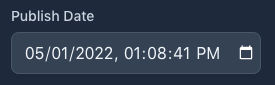
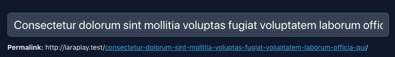
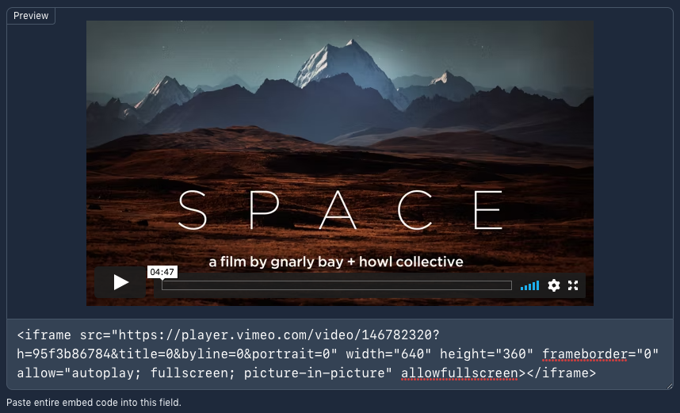

# Filament Addons

A set of components, fields and layouts to extend Filament Admin.

## Installation

```bash
composer require awcodes/filament-addons
```

## Admin

### **Fixed Sidebar Layout**

Just return it directly from your form function in your model resource.

```php
use FilamentAddons\Admin\FixedSidebar;

public static function form(Form $form): Form
{
    return FixedSidebar::make()
        ->schema([
            // Main section form components
        ], [
            // Sidebar form components
        ]);
}
```

## Forms

---

### **Date Input**



```php
use FilamentAddons\Forms\Fields\DateInput;

DateInput::make(string $fieldname)
    ->label('Publish Date')
    ->withoutTime() //optional
```

### **Password Generator**


All methods from TextInput are available.

```php
use FilamentAddons\Forms\Fields\PasswordGenerator;

PasswordGenerator::make(string $fieldname)
    ->passwordLength(int $length = 12)
    ->hasNumbers(bool $hasNumbers = true)
    ->hasSymbols(bool $hasSymbols = true)
```

### **Title With Slug**

 

Creates a TextInput with the ability to modify the slug after creation, but preserves the slug when editing to help with SEO.

```php
use FilamentAddons\Forms\Components\TitleWithSlug;

TitleWithSlug::make(
    string $titleFieldName = 'title',
    string $slugFieldName = 'slug',
    string|Closure $basePathForResource = '/'
)->columnSpan('full')
```

### **Timestamps**

Outputs Created At and Updated At information blocks.

```php
use FilamentAddons\Forms\Components\Timestamps;

Timestamps::make()
```

### **Separator**

Just outputs a sensible hr to help separate components.

```php
use FilamentAddons\Forms\Components\Separator;

Separator::make()
```

### **Video Embed**



Allows embeded code with preview. This field does not sanitize your values. You are responsible for purifying any raw html input or output.

Supports most of the Textarea field's options.

```php
use FilamentAddons\Forms\Fields\VideoEmbed;

VideoEmbed::make(string $fieldname)
    ->label('label')
    ->rows()
```

## Tables

### **Title With Status Indicator**


```php
use FilamentAddons\Tables\Columns\TitleWithStatus;

TitleWithStatus::make(string $fieldname = 'title')
    ->statusField(string $fieldname = 'status') // optional
    ->statuses(array | Arrayable (Enum) Status::class)
    ->colors(array | Arrayable (Enum) Status::colors())
    ->hiddenOn(string | null Status::Published->name) //optional
```
